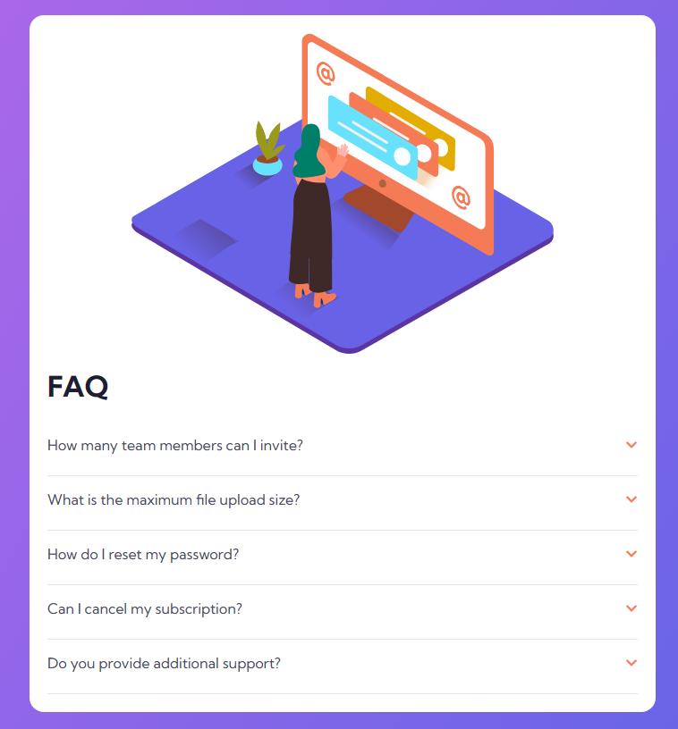
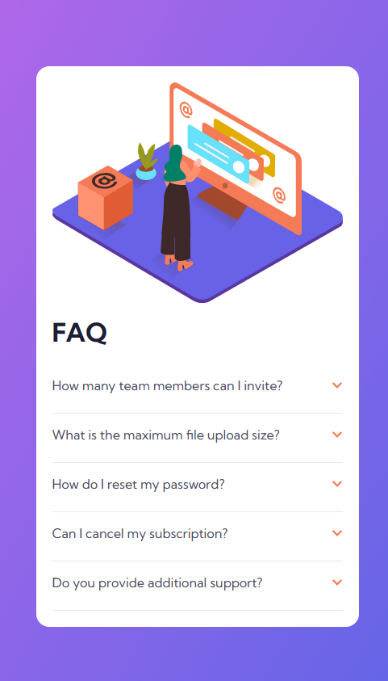
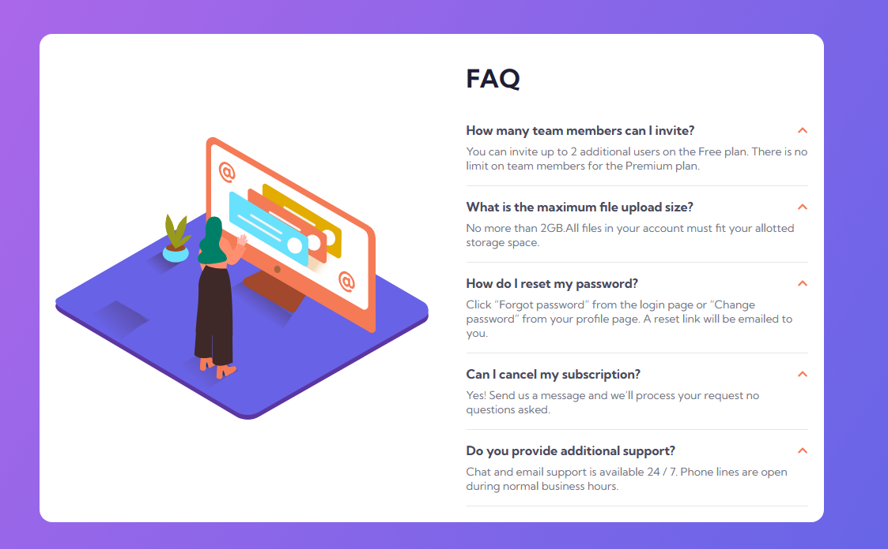

# Frontend Mentor - 6- FAQ accordion card

This is a solution to the [FAQ accordion card](https://www.frontendmentor.io/challenges/faq-accordion-card-XlyjD0Oam). Frontend Mentor challenges help you improve your coding skills by building realistic projects. 

## Table of contents

- [Overview](#overview)
  - [The challenge](#the-challenge)
  - [Screenshot](#screenshot)
  - [Links](#links)
  - [What I learned](#what-i-learned)

## Overview

### The challeng e

Users should be able to:

- View the optimal layout for the component depending on their device's screen size
- See hover states for all interactive elements on the page
- Hide/Show the answer to a question when the question is clicked

### Screenshot

### Links

- Solution URL: [NETLIFY URL](https://3-column-preview-card-component-gnr23.netlify.app/)
- Live Site URL: [GITHUB URL](https://github.com/gnr23/frontend-exercise-05-Column-preview-component)

### Built with

HTML, CSS
VS code

### What I learned

-created a single question module

-scaling for bigger screens with media queries for menus

e.g.

@media(min-width: 992px) {
    .container {
        display: flex;  
        align-items: center;
        justify-content: center;
        min-height: 100vh;
max-width: 900px;
margin:auto;
    }